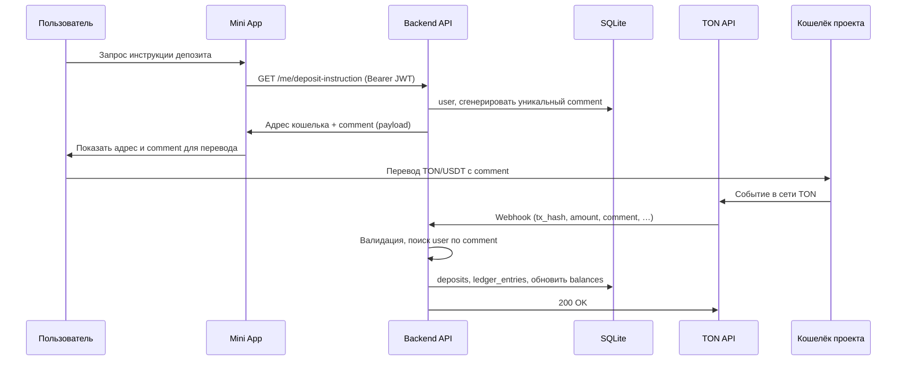
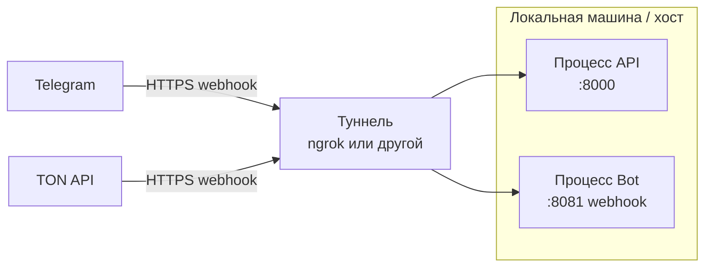

# Архитектура Gifts Futures Mini App (MVP)

Визуализация компонентов и потоков по [vision.md](../vision.md) и ADR в [doc/adr](adr/).

---

## 1. Компоненты системы

```mermaid
flowchart TB
    subgraph Telegram["Telegram"]
        User[👤 Пользователь]
        Bot[🤖 Bot (aiogram)]
        MiniApp[📱 Mini App / WebApp]
    end

    subgraph Our["Наша инфраструктура"]
        API[Backend API\nFastAPI]
        DB[(SQLite)]
    end

    subgraph External["Внешние сервисы"]
        TON[TON API\nпровайдер]
        TON_Network[Сеть TON\nкошелёк проекта]
    end

    User -->|/start, кнопки| Bot
    Bot -->|ссылка| MiniApp
    User -->|открывает| MiniApp

    MiniApp -->|REST + JSON\ninitData → JWT\nBearer token| API
    API --> DB

    User -->|TON/USDT + comment| TON_Network
    TON_Network --> TON
    TON -->|webhook\nсобытия депозитов| API
```

**Легенда:**
- **Bot** — точка входа, меню, кнопка «Открыть приложение», уведомления.
- **Mini App** — основной UI: рынок, портфель, депозит, сделки; общается с API по REST.
- **Backend API** — аутентификация (initData → JWT), рынки, балансы, приём TON webhook.
- **SQLite** — единственная БД на MVP (пользователи, балансы, депозиты, позиции, сделки).

---

## 2. Онбординг: первый вход в Mini App

```mermaid
sequenceDiagram
    participant U as Пользователь
    participant Bot as Bot
    participant App as Mini App
    participant API as Backend API
    participant DB as SQLite

    U->>Bot: /start
    Bot->>U: Кнопка «Открыть приложение»
    U->>App: Открывает Mini App (в Telegram)

    App->>App: Telegram передаёт initData
    App->>API: POST /auth (initData)
    API->>API: Проверка подписи initData
    API->>DB: Создать/найти user по telegram_user_id
    API->>App: JWT (Bearer token)

    Note over App: Сохраняет JWT
    App->>API: GET /me, GET /markets (Authorization: Bearer &lt;JWT&gt;)
    API->>App: Данные пользователя, рынки
    App->>U: Показывает UI (рынок, портфель)
```

---

## 3. Депозит TON/USDT



---

## 4. Процессы и порты (деплой MVP)



- **API** — принимает запросы от Mini App (через публичный URL туннеля или напрямую) и webhook от TON API.
- **Bot** — получает апдейты Telegram по webhook через тот же туннель (отдельный путь/порт).
- **Mini App** — статика (webapp) доступна по HTTPS (тот же туннель или отдельный static-hosting).

---

## Связанные документы

- [vision.md](../vision.md) — техническое видение и модель данных
- [idea.md](../idea.md) — продуктовая идея
- [doc/adr](adr/) — решения по архитектуре (ADR)
